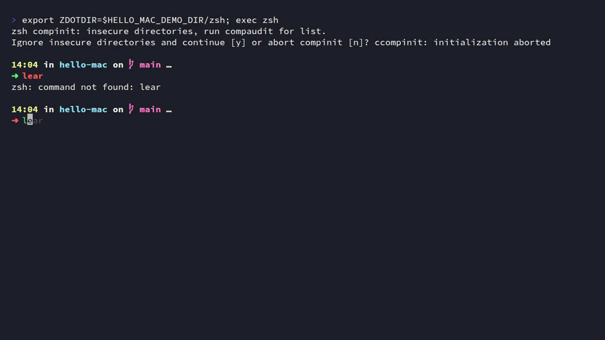

# Hello Mac

[English](README.md) · **简体中文**

**让新 Mac 准备就绪。**

用一份软件清单和几条命令，安装常用应用，配好日常使用的终端环境。

- **软件按需安装**：通过 Homebrew Brewfile 管理应用、命令行工具和字体。
- **终端开箱配置**：安装 Oh My Zsh、Spaceship、自动建议与语法高亮插件。
- **保留个人设置**：基于官方默认 `.zshrc` 增量配置；已有文件默认保留，更新前备份。
- **先预览再执行**：支持安装计划预览，适配 Apple Silicon 和 Intel 的 Homebrew 路径。

## 终端预览



由 CI 录制真实的 `--help` 和 `all --dry-run` 输出。演示不会安装应用，也不代表 macOS 原生终端窗口的外观。

## 快速开始

准备一台 macOS 电脑，确保可以访问 Homebrew 和 GitHub，并已安装 Git。首次运行 Git 时，系统可能提示安装 Xcode Command Line Tools。

```bash
git clone https://github.com/draco-china/hello-mac.git
cd hello-mac
```

### 1. 选择需要的软件

查看 [Brewfile](Brewfile)，将不需要的软件行注释掉。清单包含开发、办公、影音和商业软件，按自己的使用习惯选择即可。原有可选软件及注释均保留在清单中。

也可以维护自己的本地清单：

```bash
cp Brewfile Brewfile.local
# 编辑 Brewfile.local，保留需要安装的项目
```

### 2. 预览安装计划

```bash
./setup.sh all --file ./Brewfile.local --dry-run
```

预览不会下载、安装或写入配置；它展示将执行的命令，不检查软件可用性或系统兼容性。

### 3. 执行安装

```bash
./setup.sh all --file ./Brewfile.local
```

请以普通用户运行，不要在命令前添加 `sudo`。若尚未安装 Homebrew，脚本会启动官方安装器，由安装器按需请求权限。完成后打开新终端。

已有 `.zshrc` 时，安装组件后会保留原配置。要启用 Hello Mac 的终端配置，请参阅下方的「已有终端配置」。

## 命令

| 命令 | 用途 |
| --- | --- |
| `./setup.sh` 或 `./setup.sh apps` | 安装软件清单中的项目 |
| `./setup.sh shell` | 安装字体、Oh My Zsh、插件及主题 |
| `./setup.sh all` | 依次执行软件安装和终端配置 |
| `./setup.sh --help` | 查看帮助 |

| 选项 | 用途 |
| --- | --- |
| `--file PATH` | 为 `apps` 或 `all` 指定 Brewfile，默认使用项目中的 `Brewfile` |
| `--dry-run` | 只预览执行计划 |
| `--configure-zshrc` | 为 `shell` 或 `all` 启用已有 `.zshrc` 的增量配置，修改前备份 |

自定义 `--file` 路径相对于当前工作目录。默认软件清单和配置资源按脚本所在目录定位，因此也可以从其他目录调用脚本。

## 软件清单

[Brewfile](Brewfile) 使用 Homebrew Bundle 的声明格式：

```ruby
# 命令行工具
brew "bat"
brew "nvm"

# 图形应用和字体
cask "iterm2"
cask "visual-studio-code"
cask "font-fira-code"

# 暂不安装的项目保留为注释
# cask "postman"
```

`Brewfile.local` 已加入 `.gitignore`，适合保存个人选择。部分暂不可用的软件也以注释保留，并附有说明；重新启用前请核对对应的软件名称与安装要求。

软件安装使用 `brew bundle install --no-upgrade`，不主动升级清单中已安装的软件，但 Homebrew 仍可能按依赖需要更新组件。脚本不执行全局缓存清理。

## 终端配置

`./setup.sh shell` 安装以下组件：

| 组件 | 用途 |
| --- | --- |
| Oh My Zsh | Zsh 配置框架 |
| Spaceship | 显示目录、Git 状态等信息的提示符主题 |
| zsh-autosuggestions | 根据历史输入提供命令建议 |
| zsh-syntax-highlighting | 为输入的命令提供语法高亮 |
| Sauce Code Pro Nerd Font | 提供终端字体与提示符图标 |

### 新终端环境

没有 `.zshrc` 时，以 Oh My Zsh 官方安装器生成的文件为基础；若 Oh My Zsh 已安装，则使用其安装目录中的官方模板。Hello Mac 只在加载 Oh My Zsh 前插入自己的配置块，不维护整份默认文件副本。

[custom.zsh](config/zsh/custom.zsh) 定义主题、插件、Homebrew 路径及 NVM 加载方式。原有插件会保留，新增插件去重后加入，语法高亮插件放在最后。

配置内容在执行时写入 `.zshrc`，不是实时引用项目文件。修改项目中的增量配置后，可再次运行配置命令应用更新。

### 已有终端配置

默认保留已有 `.zshrc`。希望应用主题和插件配置时，执行：

```bash
./setup.sh shell --configure-zshrc
```

脚本先备份，再在标准的 `source "$ZSH/oh-my-zsh.sh"` 行前插入或更新 `Hello Mac` 配置块。块以外的配置和注释保留；块中的主题等设置在加载 Oh My Zsh 前生效，文件后续的个人设置仍可能覆盖它们。

如果文件中没有唯一的标准 Oh My Zsh 加载行，脚本会停止配置步骤并保留原文件。此时可参考 [增量配置](config/zsh/custom.zsh) 手动合并。

备份路径会打印在终端中，文件名为 `.zshrc.hello-mac-backup.*`。恢复时，将实际备份文件复制回去：

```bash
cp "$HOME/.zshrc.hello-mac-backup.实际后缀" "$HOME/.zshrc"
```

若 `.zshrc` 原本是符号链接，配置更新会在该路径写入普通文件，链接目标保持不变；备份保存原配置内容。

### 自定义路径

脚本读取已导出的环境变量：

| 变量 | 默认值 |
| --- | --- |
| `ZSH` | `$HOME/.oh-my-zsh` |
| `ZSH_CUSTOM` | `$ZSH/custom` |
| `ZDOTDIR` | `$HOME`，用于定位 `.zshrc` |

使用自定义 `ZDOTDIR` 时，备份与恢复也应使用该目录下的文件。若这些变量只在现有 `.zshrc` 中定义，运行脚本前请先将相应值导出到环境。

### 安装之后

在终端的字体设置中选择 **SauceCodePro Nerd Font Mono**。脚本不会自动切换默认 shell；需要时手动执行：

```bash
chsh -s /bin/zsh
```

如果软件清单中安装了 NVM，可在新终端中安装 Node.js：

```bash
nvm install --lts
```

`shell` 命令本身不安装 NVM，加载配置只在 NVM 已安装时生效。已有插件与主题仓库不会自动更新；需要更新时，在对应仓库中执行 `git pull --ff-only`。

## 配色与字体

项目附带可手动导入的 Dracula+ 配色和 iTerm2 配置示例：

| 资源 | 用途 |
| --- | --- |
| [Dracula+.itermcolors](themes/Dracula%2B.itermcolors) | iTerm2 配色 |
| [Dracula+.terminal](themes/Dracula%2B.terminal) | Apple Terminal 配色 |
| [Default.json](config/iterm2/Default.json) | iTerm2 Profile 示例 |

导入后按个人习惯调整字体、透明度和窗口设置。VS Code 可使用以下字体配置：

```json
{
  "editor.fontFamily": "'SauceCodePro Nerd Font Mono', Menlo, Monaco, monospace"
}
```

## 项目结构

```text
hello-mac/
├── setup.sh                    # 命令入口
├── Brewfile                    # 软件清单与可选条目
├── scripts/                    # Homebrew 与终端安装逻辑
├── config/
│   ├── zsh/custom.zsh           # Zsh 增量配置
│   └── iterm2/Default.json      # iTerm2 Profile 示例
├── themes/                     # 终端配色文件
└── tests/                      # 隔离环境回归测试
```

## 开发与验证

```bash
bash tests/smoke.sh
zsh -n config/zsh/custom.zsh

# 需要预先安装 ShellCheck
shellcheck -x setup.sh scripts/*.sh tests/*.sh
```

回归测试在临时目录中模拟安装命令，验证预览、参数校验、配置保留与备份、官方模板使用、重复执行及下载失败处理，不安装真实应用。GitHub Actions 还检查 Brewfile、JSON 和配色文件的语法。

这些检查不替代目标 Mac 上的完整安装验收。安装失败时请根据输出修复问题后重新运行；已完成的步骤不会自动回滚。

### 更新演示

[Terminal demo](.github/workflows/demo.yml) 使用 [VHS](https://github.com/charmbracelet/vhs) 录制 [docs/demo.tape](docs/demo.tape)。相关文件推送到 `main` 时自动运行，也可手动触发。工作流将 GIF 保存为构建产物，并仅将 `docs/demo.gif` 提交回 `main`；图片更新不会再次触发录制，过时的工作流也不会覆盖新提交。

本地安装 VHS 及其依赖后，在项目根目录执行：

```bash
vhs docs/demo.tape
```

相关文档：[Homebrew Bundle](https://docs.brew.sh/Brew-Bundle-and-Brewfile) · [Oh My Zsh](https://github.com/ohmyzsh/ohmyzsh) · [Spaceship](https://github.com/spaceship-prompt/spaceship-prompt)
